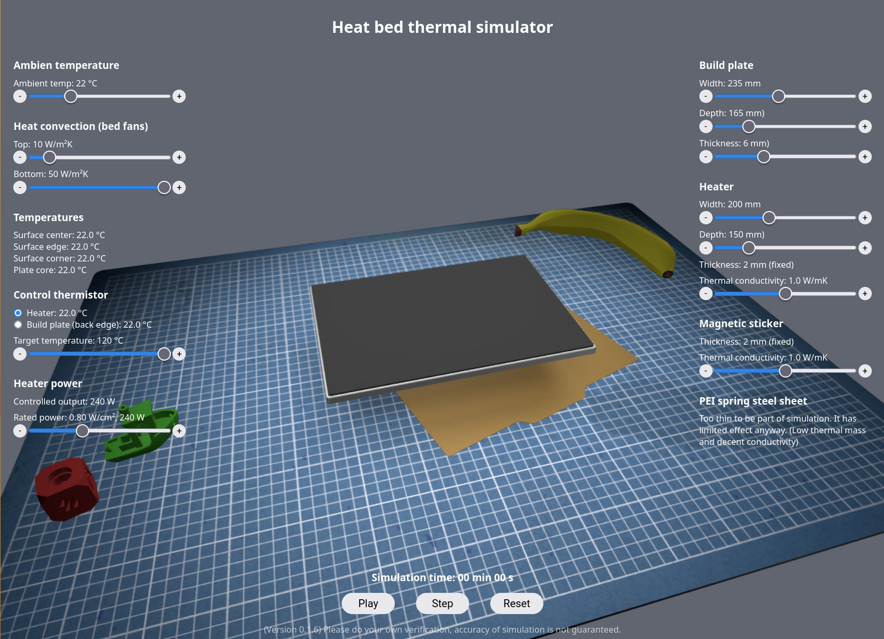

### Run application directly in your in browser
https://danielpeterson.github.io/thermalemulator/
 
 
Voron cube and banana are created by the Voron team and is licensed under the GPL v3 license. 
https://vorondesign.com/

The toy boat is created by the 3DBenchy team and is licensed under the Creative Commons License (CC-0) 
https://www.3dbenchy.com/

The application is built using THREE.js which is licensed under the MIT license 
https://threejs.org/

It also uses the GPU.js library for GPU acceleration which is licensed under the MIT license 
https://gpu.rocks/

 
 
# Heated bed thermal emulator for 3D printers
This is an emulation of the heat performance of different heated beds for 3d printers. Specifically those that use an aluminium build plate, a silicone heater and a adhesive magnetic bed mat with a spring steel sheet.

It uses gpu.js to run the simulation so you need some form of GPU in your computer for it to run at resonable speed. I created this on a Laptop with an AMD Ryzen 7 5800U with a Radeon Vega 7 GPU. So anything around that performance or faster should work. This should include any mid range desktop GPU from the last 10 years or so for reference. The update rate is capped to make sure the simulation does not run too fast on modern GPUs.

Please do not assume that this is an accurate simulation. It is meant as an interactive toy to explore the behavior of thermal systems in the context of 3d printers. It lest you test things like the evenness of heating using silicone heaters of different sizes. The effect of different aluminium plate thicknesses, heat up times and the effects of having different amounts of air blowing across the bed. It can illustrate both heatup and cooldown behavior.

If you have ideas or suggestions for improvements, feel free to leave an issue or make a pull request. Let me know if you have questions about the code.

## Simulation model
The simulation works on a regularized grid of size 0.5cm x 0.5c x 0.2cm for x, y and z. This seems to be a good tradeoff between performance and accuracy. It uses euler iteration so a small time step of 1/100th of a second is required to make the simulation stable.

Stability of the model is mostly determined by the smalles dimension of the grid cells and the thermal conductivity. Where higher thermal conductivity as well ass smaller grid dimesion lowers stability. Basically the faster the heat energy flows between the grid cells in proportion to the thermal difference between them the bigger the risk that the simulation takes too big of a step in terms of heat transfer in a single iteration for the model to remain stable.

## Conduction
It uses the Euler method to iteratively solve the differential form of fouriers law for neighbouring grid cells. 
https://en.wikipedia.org/wiki/Thermal_conduction#Differential_form

$q=-k(dT/dx)dt$

This says that the heat exchange per time unit between two neighbouring cells is proportional to the heat transfer coefficient, the contact area and the temperature gradient at the interface wich is approximated as the temperature difference of the cells divided by the distance between the two cell centroids.

If the two cells have different thermal coefficients this is handled by using the harmonic mean of the two thermal coefficients. 
https://en.wikipedia.org/wiki/Harmonic_mean

Overall this is by my understanding an inaccurate way to simulate heat transfer, but it is simplistic and seems to work well enough. Beyond thermal conduction the the simulation also takes into account surface convection and thermal radiation.

## Convection
The convecetion is modeled like this: 
https://en.wikipedia.org/wiki/Heat_transfer_coefficient

Specifically the $Q=hA(T_2-T_1)$ equation.

It sucks heat energy out of the grid cubes that are at the edge of the simulation each iteration.

## Radiation
The thermal radiation is modeled like this:  
https://en.wikipedia.org/wiki/Thermal_radiation#Radiative_power

Specifically the $P=εσAT^4$ equation.

I picked reasonable estimates for all constants wherever I could not find any actual data.

The T in the radiative power equation is the difference in temperature between the surface and the environment so what it calculates is the relative heat transfer between the two via radiation. So in that sense it does take the radiation from the environment back to the build plate into account. The simulation currently does not take internal radiation into account. The idea is that all parts of the build plate have very similar temperature and so this effect ought to be negligible in practice.

## Calculation example
The convection is directly proportional to the temperature difference and straight forward to approximate. Here is an example for a 300x300 build plate at 110 °C with a 30 °C ambient using a heat transfer coefficient of 5 W/(m²K):

$Q = hA(T2-T1) = 5 * (0.3 * 0.3 * 2) * (110 - 30) = 72 W$

The transfer coefficient is mostly dependent on how fast the air is moving across the surface so with bed fans the heat transfer will be considerably higher.

Calculating the thermal radiation for the same example using a surface emissivity coefficient (ε) of 0.9 W/(m²K) gives:

$P=εσAT⁴ = 0.9 * 0.0000000567 * (0.3 * 0.3 * 2) * ((110 + 273)⁴-(30 + 274)⁴) = 119 W$

(Note that the temperature difference here is measured in Kelvin and hence the (T + 273) to convert from Celsius to Kelvin)

At even higher temperatures the thermal radiation becomes completely dominant because of the temperature difference being raised to the power of 4 in the equation.

